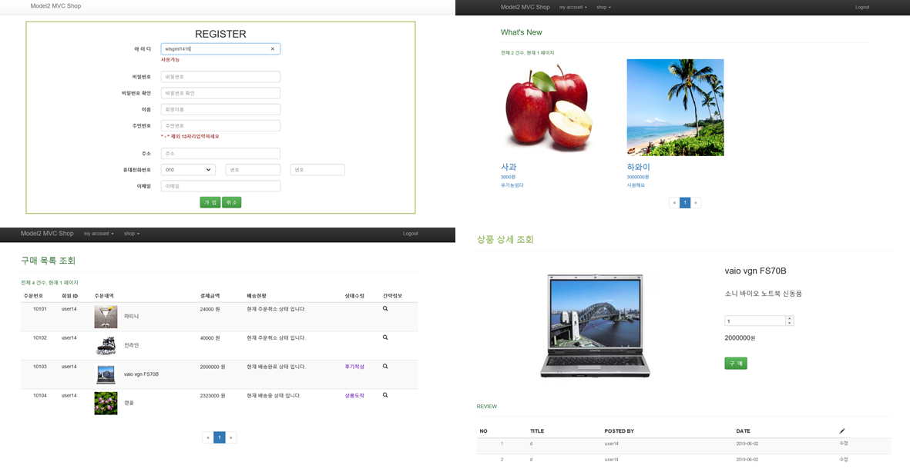

# 쇼핑몰

# phoenix

회원관리, 상품관리, 구매관리, 배송관리, 재고관리, 리뷰관리 등 쇼핑몰의 전반적인 기능을 제공하는 시스템

# 1. 사용기술

•Language : JAVA 1.8, JSP, HTML5, CSS3, JavaScript

•Database : oracle 11g

•Web Server : Apache Tomcat 9.0.21

•Framwork : Spring 4.0.9, JDBC, jQuery, BootStrap, JUnit4, Log4jdbc, Aspectj, JSON-simple, Jackson, MyBatis 3.2.1

•Etc : AJAX

•Tool : eclipse, Oracle SQL Developer, GitHub

# 2. 기능

• 일반 회원 관리 기능

• 관리자의 상품 등록, 수정, 삭제, 재고관리 기능

• 상품을 구매 후 구매 내역 확인 기능

• 구매한 상품에 대한 후기 작성 기능

• 최근 등록한 상품 확인 기능

# 3. 화면구성

